<div align="center">

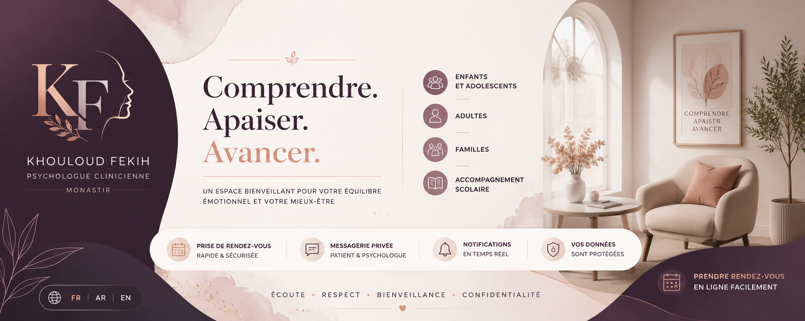

<br>

# Khouloud Fekih Psychology Platform

### Multilingual Appointment Booking, Patient Portal & Practice Management Application

**Flask · Python · SQLite · Jinja2 · HTML5 · CSS3 · JavaScript · Responsive Design**

<br>

<p align="center">


</p>

<br>

A complete multilingual web platform connecting a clinical psychologist with patients through appointment booking, dedicated dashboards, notifications and private messaging.

</div>

[Overview](#overview) ·
[Features](#core-features) ·
[Screenshots](#platform-showcase) ·
[Architecture](#system-architecture) ·
[Installation](#installation)

</div>

---

## Table of Contents

- [Overview](#overview)
- [Project Context](#project-context)
- [Business Need](#business-need)
- [Project Objectives](#project-objectives)
- [Core Features](#core-features)
- [Platform Showcase](#platform-showcase)
  - [Public Homepage](#public-homepage)
  - [Appointment Request Form](#appointment-request-form)
  - [Patient Appointment Space](#patient-appointment-space)
  - [Patient Messaging](#patient-messaging)
  - [Administrator Dashboard](#administrator-dashboard)
  - [Appointment Request Management](#appointment-request-management)
- [Multilingual Experience](#multilingual-experience)
- [Patient Journey](#patient-journey)
- [Administrator Workflow](#administrator-workflow)
- [Appointment Management](#appointment-management)
- [Messaging System](#messaging-system)
- [Notification System](#notification-system)
- [Authentication and Access Control](#authentication-and-access-control)
- [System Architecture](#system-architecture)
- [Application Workflow](#application-workflow)
- [Database Design](#database-design)
- [Security Design](#security-design)
- [Technology Stack](#technology-stack)
- [Frontend Design](#frontend-design)
- [Responsive Design](#responsive-design)
- [Repository Structure](#repository-structure)
- [Installation](#installation)
- [Configuration](#configuration)
- [Running the Application](#running-the-application)
- [Application Routes](#application-routes)
- [Testing](#testing)
- [Deployment](#deployment)
- [Privacy and Data Protection](#privacy-and-data-protection)
- [Limitations](#limitations)
- [Future Improvements](#future-improvements)
- [Author](#author)
- [Acknowledgements](#acknowledgements)

---

## Overview

**Khouloud Fekih Psychology Platform** is a multilingual full-stack web application created for a clinical psychologist based in Monastir, Tunisia.

The platform provides a unified digital environment where visitors and registered patients can:

- discover the psychologist and her professional approach;
- explore available psychological support services;
- create and access a personal patient account;
- submit appointment requests online;
- choose a consultation type;
- select a preferred date and time;
- follow the status of submitted requests;
- receive notifications;
- communicate through a private messaging space.

The psychologist accesses a separate professional area where appointments, requests and conversations can be managed.

```text
Public Website
      │
      ├── Professional Presentation
      ├── Psychological Services
      ├── Contact Information
      ├── Multilingual Content
      └── Appointment Call-to-Action
                 │
                 ▼
          Patient Authentication
                 │
                 ▼
       Appointment Request System
                 │
                 ▼
          Patient Dashboard
                 │
          ┌──────┴──────┐
          ▼             ▼
   Notifications     Messaging
          │             │
          └──────┬──────┘
                 ▼
        Professional Dashboard
                 │
                 ▼
       Appointment Management
```

The project demonstrates the design and development of a practical web product rather than an isolated technical prototype.

---

## Project Context

This platform was developed for the professional activity of **Khouloud Fekih**, a clinical psychologist.

The application combines:

- a professional public website;
- multilingual content management;
- patient registration and authentication;
- online appointment requests;
- a patient dashboard;
- an administrator dashboard;
- appointment status management;
- patient–psychologist messaging;
- notifications;
- relational data storage.

### Main engineering areas

- backend development with Flask;
- database management with SQLite;
- dynamic rendering with Jinja2;
- session-based authentication;
- form validation;
- appointment lifecycle management;
- multilingual interface design;
- Arabic right-to-left support;
- dashboard development;
- responsive user-interface design;
- private messaging;
- notification management.

---

## Business Need

Independent healthcare and well-being professionals often depend on fragmented communication channels such as:

- telephone calls;
- social-media messages;
- messaging applications;
- manually managed calendars;
- paper appointment records.

These workflows may create several difficulties.

### Appointment coordination

Patients may not know:

- which consultation type to choose;
- which date and time to request;
- whether the appointment request was accepted;
- whether a response has been sent.

### Administrative organisation

The professional needs to:

- view all appointment requests;
- identify pending requests;
- confirm appointments;
- cancel appointments;
- return appointments to pending status;
- search for patients;
- filter requests;
- monitor daily activity.

### Communication

Patients may need a dedicated channel for practical questions related to appointments and follow-up.

### Language accessibility

The target audience may prefer:

- French;
- Arabic;
- English.

The platform centralises these interactions in one coherent web application.

---

## Project Objectives

| Objective | Implemented Capability | Value |
|---|---|---|
| Present the professional activity | Public multilingual website | Improve digital presence |
| Simplify appointment requests | Online booking form | Reduce manual coordination |
| Track submitted requests | Patient dashboard | Improve transparency |
| Manage appointment statuses | Admin dashboard | Centralise administrative work |
| Facilitate communication | Private messaging | Create a dedicated exchange channel |
| Inform patients | Notification system | Improve follow-up |
| Support multiple languages | French, Arabic and English | Increase accessibility |
| Store application data | SQLite database | Maintain persistent records |
| Separate access roles | Patient and admin areas | Protect administrative functions |
| Deliver a professional UX | Responsive premium interface | Improve usability and trust |

---

## Core Features

### Public website

- modern landing page;
- professional profile;
- presentation of the psychological approach;
- service and accompaniment pages;
- contact information;
- office imagery;
- call-to-action buttons;
- multilingual navigation.

### Patient authentication

- account registration;
- patient login;
- session management;
- logout;
- protected patient pages.

### Appointment requests

- contact information collection;
- consultation-type selection;
- preferred-date selection;
- preferred-time selection;
- general-reason field;
- request creation;
- appointment-status tracking.

### Patient dashboard

- appointment history;
- appointment-request details;
- status badges;
- pending-request cancellation;
- notifications;
- access to private messaging.

### Administrator dashboard

- total appointment requests;
- pending-request count;
- confirmed-appointment count;
- cancelled-appointment count;
- daily agenda;
- recent requests;
- search;
- filtering;
- sorting;
- appointment status management.

### Messaging

- patient–psychologist conversations;
- sender-specific message styles;
- timestamps;
- persistent conversation history;
- administrator messaging interface.

### Multilingual system

- French interface;
- Arabic interface;
- English interface;
- session-based language selection;
- right-to-left Arabic rendering.

---

# Platform Showcase

The following visuals present the principal pages and workflows of the platform.

---

## Public Homepage

<p align="center">
  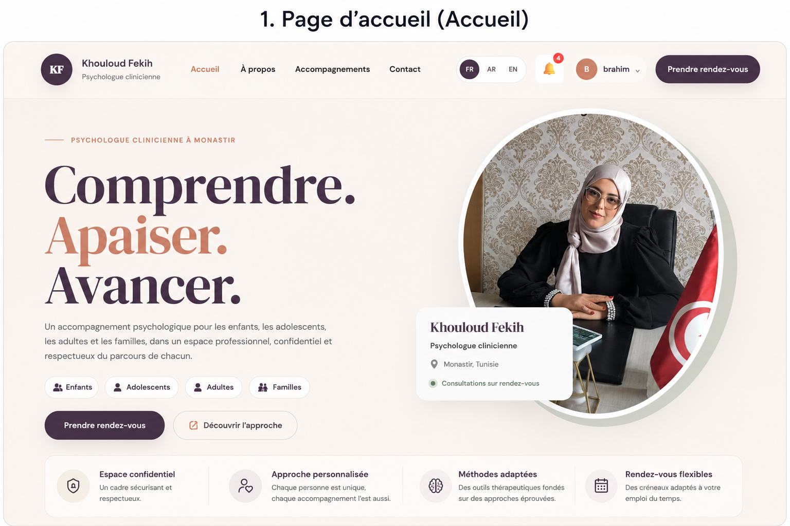
</p>

The homepage introduces the psychologist through a refined and reassuring interface.

### Homepage content

- psychologist name and professional title;
- Monastir location;
- appointment availability;
- target audiences;
- appointment call-to-action;
- clinical-approach discovery;
- language selector;
- authenticated-user navigation;
- notifications.

### Main identity

```text
Comprendre.
Apaiser.
Avancer.
```

The interface communicates professionalism and reassurance through:

- cream and off-white backgrounds;
- deep plum typography;
- warm peach accents;
- elegant serif headings;
- generous spacing;
- rounded cards;
- subtle shadows.

---

## Appointment Request Form

<p align="center">
  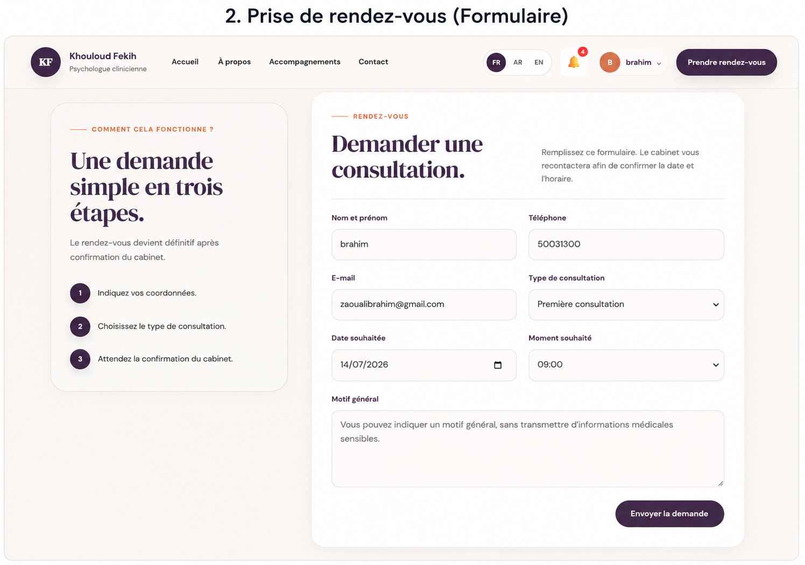
</p>

The appointment page guides the patient through a clear request process.

### Booking steps

```text
1. Enter contact information
2. Select a consultation type
3. Choose a preferred date
4. Choose a preferred time
5. Provide an optional general reason
6. Submit the request
7. Wait for office confirmation
```

### Form fields

- full name;
- telephone number;
- email address;
- consultation type;
- desired date;
- desired time;
- general reason.

### Appointment principle

Submitting the form creates an appointment **request**.

The appointment becomes definitive only after the psychologist or office confirms it.

### Privacy-conscious design

The reason field encourages patients to provide only general information without transmitting unnecessary sensitive clinical details.

---

## Patient Appointment Space

<p align="center">
  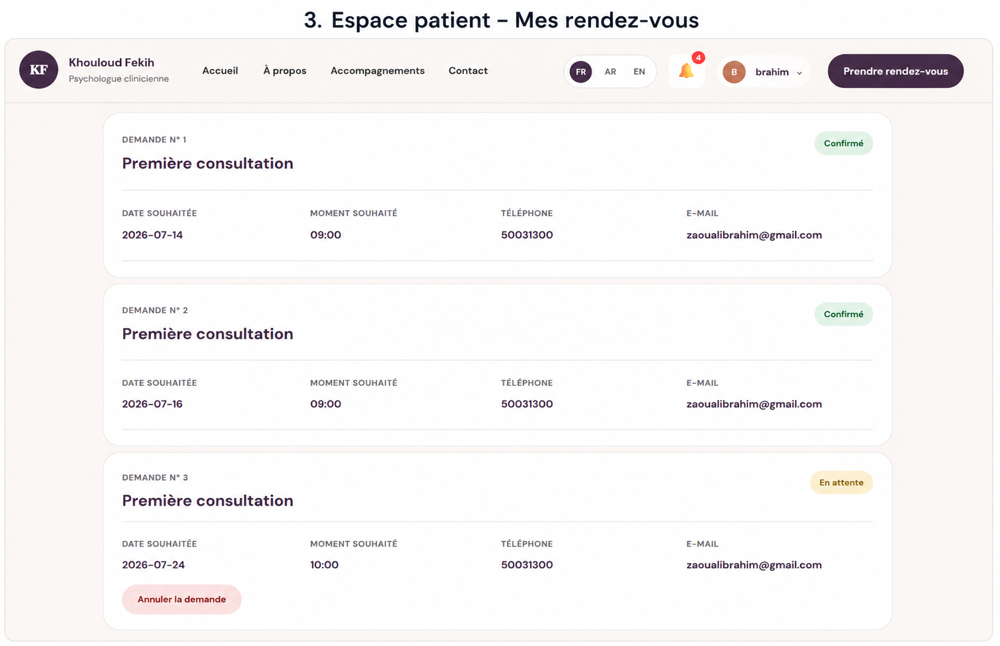
</p>

The patient area centralises all submitted appointment requests.

### Information displayed

- request number;
- consultation type;
- desired date;
- desired time;
- phone number;
- email;
- current status.

### Supported statuses

| Status | Meaning |
|---|---|
| Pending | Awaiting administrative review |
| Confirmed | Approved by the office |
| Cancelled | Cancelled by the patient or administrator |

### Patient actions

Patients can:

- view request history;
- monitor appointment status;
- inspect appointment information;
- cancel eligible pending requests.

### Visual status language

- green for confirmed appointments;
- yellow for pending requests;
- red or soft pink for cancellation actions.

---

## Patient Messaging

<p align="center">
  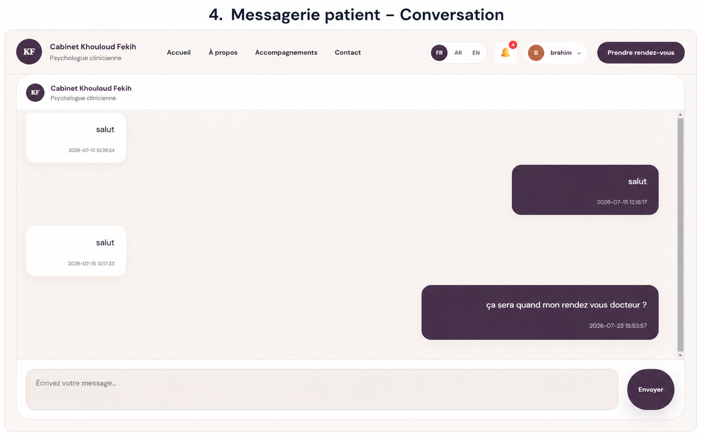
</p>

The messaging interface provides a private communication channel between the patient and the psychology office.

### Messaging capabilities

- protected access;
- persistent message history;
- message timestamps;
- differentiated sender styles;
- message composition field;
- direct send action;
- patient-specific conversations.

### Communication flow

```text
Patient Sends Message
        │
        ▼
Message Stored in SQLite
        │
        ▼
Message Appears in Admin Area
        │
        ▼
Administrator Responds
        │
        ▼
Response Appears in Patient Space
```

The messaging feature is intended for practical communication such as:

- appointment confirmation questions;
- schedule clarifications;
- administrative information;
- general appointment follow-up.

It is not designed as an emergency service or a replacement for a clinical consultation.

---

## Administrator Dashboard

<p align="center">
  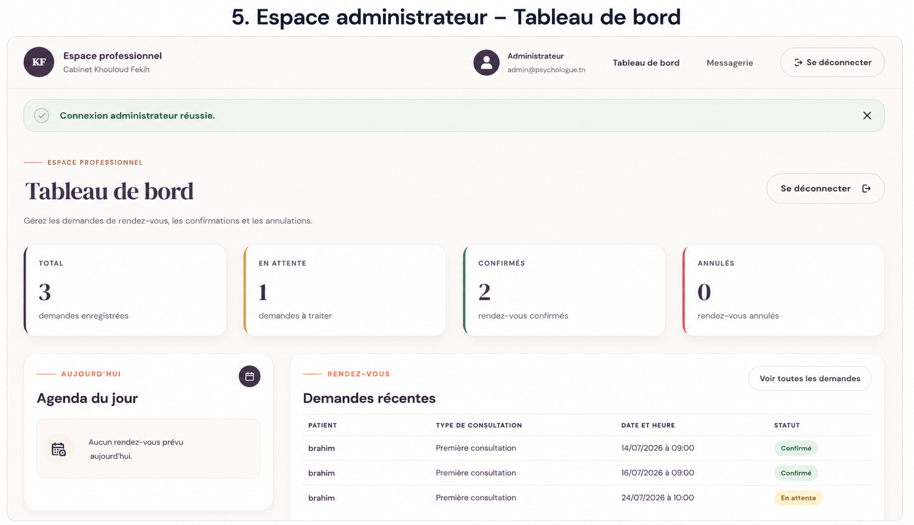
</p>

The professional dashboard provides a global overview of appointment activity.

### Dashboard indicators

- total requests;
- pending requests;
- confirmed appointments;
- cancelled appointments.

### Operational sections

- daily agenda;
- recent appointment requests;
- patient identity;
- consultation type;
- appointment date and time;
- current status.

### Professional navigation

- dashboard;
- messaging;
- administrator identity;
- secure logout.

---

## Appointment Request Management

<p align="center">
  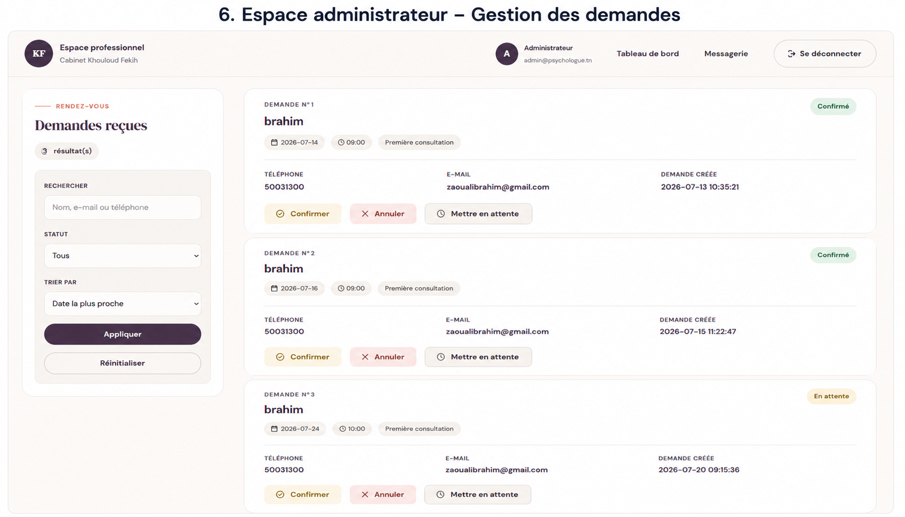
</p>

The request-management page enables the administrator to search, filter and process appointment requests.

### Search capabilities

Requests can be searched using:

- patient name;
- email address;
- telephone number.

### Filtering capabilities

Requests can be filtered by:

- all statuses;
- pending;
- confirmed;
- cancelled.

### Sorting

Requests can be sorted by appointment date.

### Administrator actions

- confirm appointment;
- cancel appointment;
- return appointment to pending;
- view patient contact details;
- inspect request creation date.

### Appointment lifecycle

```text
New Request
     │
     ▼
Pending
  ┌──┴─────────────┐
  ▼                ▼
Confirmed       Cancelled
  │
  └──────► Pending Again
           when authorised
```

---

## Multilingual Experience

The platform supports three languages.

| Language | Code | Direction |
|---|---|---|
| French | FR | Left to right |
| Arabic | AR | Right to left |
| English | EN | Left to right |

### French

French is the principal interface language.

### Arabic

The Arabic interface includes:

- translated navigation;
- translated buttons;
- translated page content;
- right-to-left text alignment;
- RTL-aware layout behaviour.

### English

The English version extends the website to additional visitors and patients.

### Language workflow

```text
User Selects Language
          │
          ▼
Language Saved in Session
          │
          ▼
Translation Content Loaded
          │
          ▼
Jinja Template Rendered
          │
          ▼
RTL Enabled for Arabic
```

---

## Patient Journey

```text
Visit Homepage
      │
      ▼
Discover Services
      │
      ▼
Create Account / Login
      │
      ▼
Submit Appointment Request
      │
      ▼
Request Saved as Pending
      │
      ▼
View Request in Dashboard
      │
      ▼
Receive Status Update
      │
      ├── Confirmed
      ├── Pending
      └── Cancelled
      │
      ▼
Communicate through Messaging
```

### Journey objectives

- reduce booking complexity;
- make statuses transparent;
- maintain consistent navigation;
- centralise patient information;
- provide direct communication;
- reduce administrative uncertainty.

---

## Administrator Workflow

```text
Administrator Login
        │
        ▼
Professional Dashboard
        │
        ├── Review Statistics
        ├── View Daily Agenda
        ├── Inspect Recent Requests
        └── Access Messaging
                    │
                    ▼
          Appointment Management
                    │
             ┌──────┼──────┐
             ▼      ▼      ▼
          Confirm  Cancel  Pending
                    │
                    ▼
          Patient Status Updated
                    │
                    ▼
              Notification
```

### Professional goals

- centralise incoming requests;
- prioritise pending appointments;
- reduce manual coordination;
- simplify follow-up;
- preserve request history.

---

## Appointment Management

The appointment workflow represents the main business process of the application.

### Appointment information

An appointment request may contain:

```json
{
  "patient_name": "Example Patient",
  "email": "patient@example.com",
  "phone": "00000000",
  "consultation_type": "First consultation",
  "desired_date": "2026-07-24",
  "desired_time": "10:00",
  "reason": "General appointment reason",
  "status": "pending",
  "created_at": "2026-07-20 09:15:36"
}
```

### Consultation categories

The application may support categories such as:

- first consultation;
- psychological follow-up;
- child consultation;
- adolescent consultation;
- adult consultation;
- family consultation.

### Status transitions

| Current status | Available transition |
|---|---|
| Pending | Confirmed |
| Pending | Cancelled |
| Confirmed | Pending |
| Confirmed | Cancelled |
| Cancelled | Pending, when authorised |

---

## Messaging System

The platform contains separate messaging views for patients and administrators.

### Patient side

Patients can:

- open their private conversation;
- view previous messages;
- send a message;
- see timestamps.

### Administrator side

The administrator can:

- access patient conversations;
- view conversation histories;
- reply to patients;
- identify unread exchanges.

### Message structure

```json
{
  "id": 1,
  "sender_type": "user",
  "sender_id": 5,
  "recipient_type": "admin",
  "recipient_id": 1,
  "content": "Message content",
  "is_read": false,
  "created_at": "2026-07-23 15:53:57"
}
```

---

## Notification System

Notifications inform users about important platform events.

### Possible notification events

- appointment request submitted;
- appointment confirmed;
- appointment cancelled;
- request returned to pending;
- new message received;
- administrator response available.

### Notification lifecycle

```text
Application Event
      │
      ▼
Notification Created
      │
      ▼
Unread Counter Updated
      │
      ▼
User Opens Notification
      │
      ▼
Notification Marked as Read
```

---

## Authentication and Access Control

The platform separates public, patient and administrator permissions.

### Public visitor

A visitor can access:

- homepage;
- about page;
- services;
- contact page;
- registration;
- login.

### Authenticated patient

A patient can access:

- personal appointments;
- appointment requests;
- notifications;
- private conversation;
- account-related functions.

### Administrator

The administrator can access:

- appointment statistics;
- all requests;
- status-management actions;
- professional messaging;
- patient-related administrative information.

### Role separation

```text
Public Visitor
      │
      ├── Public Pages
      ├── Registration
      └── Login

Authenticated Patient
      │
      ├── Patient Dashboard
      ├── Appointment Requests
      ├── Notifications
      └── Messaging

Authenticated Administrator
      │
      ├── Admin Dashboard
      ├── Request Management
      ├── Appointment Actions
      └── Admin Messaging
```

---

## System Architecture

<p align="center">
  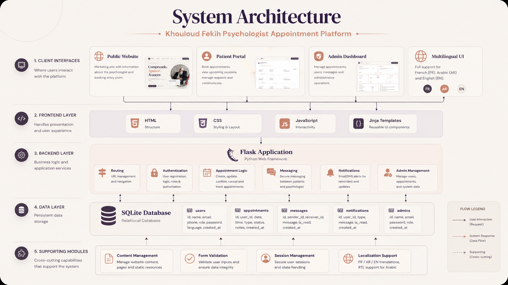
</p>

The application follows a server-rendered Flask architecture.

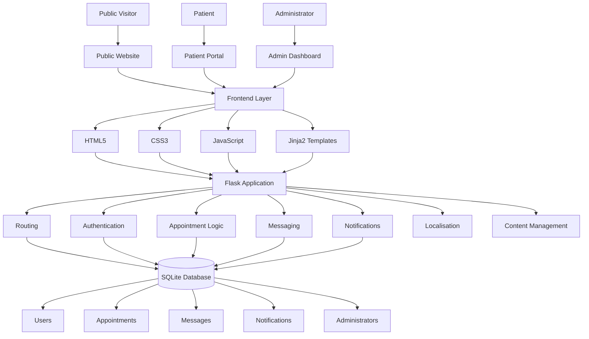

### Presentation layer

Implemented using:

- HTML5;
- CSS3;
- JavaScript;
- Jinja2.

### Application layer

Implemented with Flask and responsible for:

- routing;
- session handling;
- authentication;
- form processing;
- appointment management;
- status updates;
- messaging;
- notifications;
- localisation.

### Data layer

Implemented using SQLite.

---

## Application Workflow

<p align="center">
  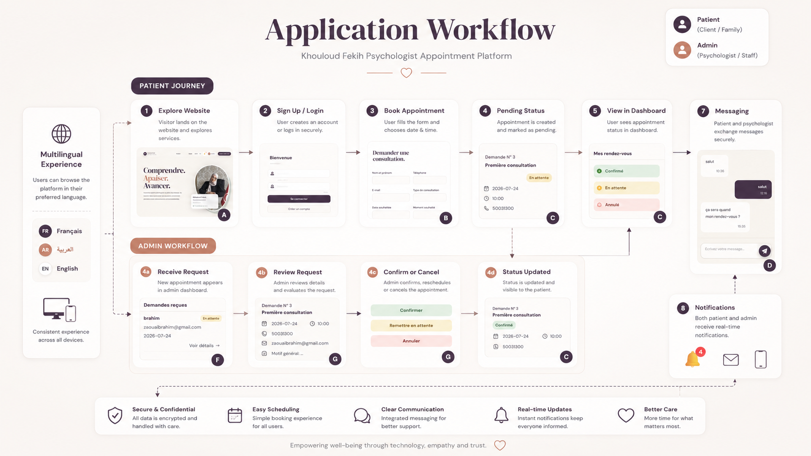
</p>

### Patient workflow

```text
Browse Website
      │
      ▼
Register / Login
      │
      ▼
Submit Appointment Request
      │
      ▼
Pending Status
      │
      ▼
View Patient Dashboard
      │
      ▼
Receive Status Update
      │
      ▼
Use Private Messaging
```

### Administrator workflow

```text
Receive Request
      │
      ▼
Review Patient Information
      │
      ▼
Confirm / Cancel / Return to Pending
      │
      ▼
Update Appointment Status
      │
      ▼
Patient Dashboard Updated
      │
      ▼
Notification Created
```

---

## Database Design

<p align="center">
  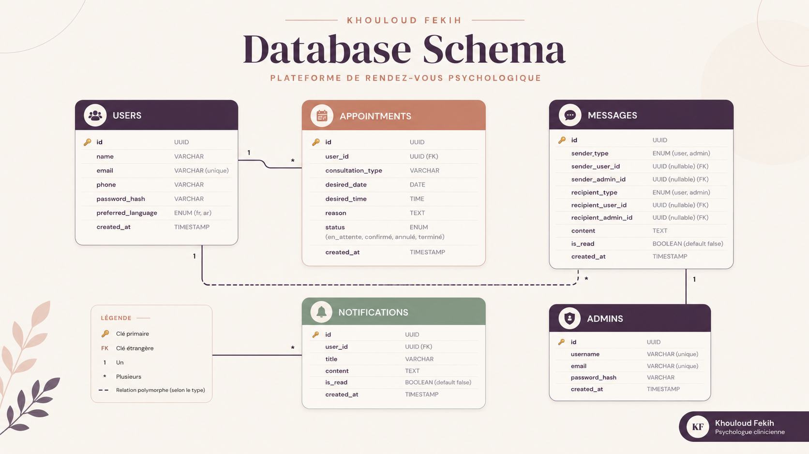
</p>

The application uses a relational SQLite database.

### Main entities

- users;
- appointments;
- messages;
- notifications;
- administrators.

### Conceptual relationships

```text
USER
  │
  ├── has many APPOINTMENTS
  ├── has many NOTIFICATIONS
  └── participates in MESSAGES

ADMINISTRATOR
  │
  └── participates in MESSAGES
```

### Users

Potential fields:

- ID;
- name;
- email;
- phone;
- password hash;
- preferred language;
- creation date.

### Appointments

Potential fields:

- ID;
- user ID;
- consultation type;
- desired date;
- desired time;
- reason;
- status;
- creation date.

### Messages

Potential fields:

- ID;
- sender type;
- sender ID;
- recipient type;
- recipient ID;
- content;
- read status;
- creation date.

### Notifications

Potential fields:

- ID;
- user ID;
- title;
- content;
- read status;
- creation date.

### Administrators

Potential fields:

- ID;
- username;
- email;
- password hash;
- creation date.

> The diagram represents the functional model. The application’s real SQLite schema remains the definitive source for exact fields and constraints.

---

## Security Design

<p align="center">
  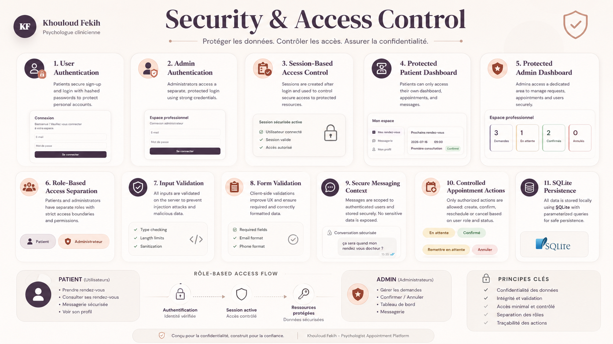
</p>

The application uses controlled access and role separation.

### Security principles

- authenticated patient routes;
- authenticated administrator routes;
- session-based access control;
- role separation;
- server-side form validation;
- controlled appointment actions;
- parameterised database queries;
- minimal data exposure;
- logout functionality.

### Input validation

Forms should validate:

- required fields;
- email format;
- phone-number format;
- date format;
- time selection;
- consultation type;
- text length.

### Protected-resource flow

```text
Protected Route Requested
          │
          ▼
Valid Session?
     ┌────┴────┐
     │         │
    Yes        No
     │         │
     ▼         ▼
Role Check   Redirect to Login
     │
     ▼
Authorised Resource
```

### Repository security

The repository must never contain:

- production passwords;
- Flask secret keys;
- real patient databases;
- confidential messages;
- medical information;
- private backups;
- environment files containing secrets.

---

## Technology Stack

| Layer | Technology | Purpose |
|---|---|---|
| Programming | Python | Core application logic |
| Backend framework | Flask | Routing and request handling |
| Template engine | Jinja2 | Dynamic page rendering |
| Database | SQLite | Persistent relational storage |
| Structure | HTML5 | Web-page markup |
| Styling | CSS3 | Premium responsive interface |
| Interactions | JavaScript | Client-side behaviour |
| Content | Python content module | Multilingual content management |
| Authentication | Flask sessions | Protected patient and admin areas |
| Version control | Git and GitHub | Source-code management |

### Technical keywords

```text
Python
Flask
SQLite
Jinja2
HTML5
CSS3
JavaScript
Session Authentication
Responsive Web Design
RTL Arabic Support
Multilingual Web Application
Appointment Management
Patient Portal
Admin Dashboard
Private Messaging
Notifications
```

---

## Frontend Design

The interface follows a coherent visual identity.

### Colour system

- dark plum;
- warm peach;
- cream;
- off-white;
- green confirmation indicators;
- yellow pending indicators;
- soft red cancellation indicators.

### Typography

The platform combines:

- elegant serif headings;
- clean sans-serif interface text.

### Components

- rounded cards;
- pill-shaped buttons;
- status badges;
- language controls;
- notification counters;
- appointment cards;
- dashboard statistics;
- message bubbles;
- responsive forms.

### UX principles

- calm visual atmosphere;
- clear hierarchy;
- visible status indicators;
- prominent primary actions;
- consistent spacing;
- accessible labels;
- reduced cognitive load.

---

## Responsive Design

The platform is designed for:

- desktop;
- tablet;
- mobile.

### Responsive considerations

- flexible containers;
- scalable typography;
- adaptive cards;
- stacked form fields;
- touch-friendly controls;
- responsive images;
- RTL-aware layouts.

### Desktop design

The desktop version uses:

- wide layouts;
- large hero typography;
- two-column appointment pages;
- dashboard metric grids;
- large conversation panels.

### Mobile improvements

A production mobile version may include:

- collapsible navigation;
- single-column dashboards;
- compact appointment cards;
- mobile-optimised chat;
- reduced decorative content.

---

## Repository Structure

```text
psychologist-appointment-platform/
│
├── assets/
│   ├── accueil.png
│   ├── architecture.png
│   ├── conversation.png
│   ├── database.png
│   ├── espacepatientrendez.png
│   ├── formulaire.png
│   ├── gestiondemande.png
│   ├── logo.png
│   ├── security.png
│   ├── tableaudebord.png
│   └── workflow.png
│
├── database/
│   └── psychologue.db
│
├── static/
│   ├── css/
│   │   ├── premium-theme.css
│   │   └── style.css
│   │
│   ├── images/
│   │   ├── cabinet-khouloud-fekih-psychologie-enfants.jpg
│   │   ├── centre-education-enfants-monastir.jpg
│   │   ├── difficultes-scolaires-apprentissages-enfants-a-monastir.jpg
│   │   ├── imm-el-makateb-monastir.jpg
│   │   ├── khouloud.jpeg
│   │   ├── Psychological-Montessori-Solutions-monastir.jpg
│   │   ├── psychologie-enfants-education-monastir.jpg
│   │   └── troubles-enfants-psychologie-monastir.jpg
│   │
│   └── js/
│       └── main.js
│
├── templates/
│   ├── about.html
│   ├── admin_conversation.html
│   ├── admin_dashboard.html
│   ├── admin_login.html
│   ├── admin_messages.html
│   ├── appointment.html
│   ├── appointment_success.html
│   ├── base.html
│   ├── contact.html
│   ├── index.html
│   ├── login.html
│   ├── patient_dashboard.html
│   ├── patient_messages.html
│   ├── services.html
│   └── signup.html
│
├── .gitignore
├── app.py
├── content.py
├── requirements.txt
└── README.md
```

---

## Installation

### Prerequisites

Install:

- Python 3.10 or later;
- Git;
- pip.

### Clone the repository

```bash
git clone https://github.com/sarah-falehh/psychologist-appointment-platform.git
cd psychologist-appointment-platform
```

### Create a virtual environment

```bash
python -m venv .venv
```

### Activate on Windows PowerShell

```powershell
.venv\Scripts\Activate.ps1
```

### Activate on Windows Command Prompt

```cmd
.venv\Scripts\activate.bat
```

### Activate on Linux or macOS

```bash
source .venv/bin/activate
```

### Install dependencies

```bash
python -m pip install --upgrade pip
pip install -r requirements.txt
```

---

## Configuration

Create an environment file when environment-based configuration is used:

```text
.env
```

Example:

```env
FLASK_SECRET_KEY=replace_with_a_secure_random_value
FLASK_ENV=development
DATABASE_PATH=database/psychologue.db
```

Do not commit the real `.env` file.

```gitignore
.env
*.env
!.env.example
```

---

## Running the Application

Run the application from the repository root:

```bash
python app.py
```

Open:

```text
http://127.0.0.1:5000
```

The Flask development server is intended for local development only.

---

## Application Routes

The application includes routes associated with the following areas.

### Public pages

```text
/
/about
/services
/contact
```

### Authentication

```text
/signup
/login
/logout
```

### Patient area

```text
/rendez-vous
/mon-espace
/mon-espace/messages
```

### Administrator area

```text
/admin/login
/admin
/admin/messages
/admin/conversation
```

> Exact routes may differ. Refer to `app.py` for the definitive route definitions.

---

## Testing

### Public website

Verify:

- homepage rendering;
- page navigation;
- language switching;
- Arabic RTL layout;
- contact information;
- images and links.

### Authentication

Test:

- patient registration;
- valid login;
- invalid login;
- duplicate-email handling;
- logout;
- protected-page redirection.

### Appointment requests

Test:

- required fields;
- invalid input;
- date selection;
- time selection;
- consultation types;
- successful request creation;
- patient-dashboard visibility.

### Administrator functions

Test:

- admin authentication;
- dashboard statistics;
- appointment search;
- status filters;
- sorting;
- confirmation;
- cancellation;
- pending restoration.

### Messaging

Test:

- patient message creation;
- administrator replies;
- message ordering;
- timestamps;
- conversation separation.

---

## Deployment

### Development architecture

```text
Browser
   │
   ▼
Flask Development Server
   │
   ▼
SQLite Database
```

### Recommended production architecture

```text
Browser
   │
   ▼
HTTPS Reverse Proxy
   │
   ▼
Production WSGI Server
   │
   ▼
Flask Application
   │
   ▼
Production Database
```

### Recommended production components

- Waitress or Gunicorn;
- Nginx or Apache;
- HTTPS;
- environment-based secrets;
- backups;
- application logs;
- monitoring;
- secure hosting.

### Database evolution

SQLite is appropriate for:

- local development;
- demonstrations;
- prototypes;
- low-traffic use.

For higher concurrency, consider:

- MySQL;
- PostgreSQL;
- managed relational database services.

---

## Privacy and Data Protection

A psychology-related application requires strict caution regarding personal data.

### Public repository rules

The repository should contain only:

- fictional test users;
- synthetic appointments;
- generic messages;
- non-sensitive demonstration data.

It must not contain:

- real patient identities;
- real patient phone numbers;
- private email addresses;
- medical details;
- consultation notes;
- private conversations;
- production database backups.

### Database exclusion

The database should be ignored:

```gitignore
database/*.db
database/*.sqlite
database/*.sqlite3
```

### Screenshot data

Screenshots should use:

- fictional names;
- dummy email addresses;
- fictional phone numbers;
- neutral conversation content.

---

## Limitations

- The platform is not certified medical software.
- The messaging system is not an emergency channel.
- SQLite may not support high-concurrency production needs.
- Production deployment requires additional security configuration.
- Real patient data must not be published.
- Appointment availability depends on application configuration.
- Email or SMS notifications require external services.
- Accessibility should be reviewed using dedicated tools.
- Production use requires legal and data-protection review.
- Generated visual diagrams represent the project architecture and design concept.

---

## Future Improvements

### Appointment management

- real-time availability calendar;
- double-booking prevention;
- configurable office hours;
- absence management;
- appointment rescheduling;
- recurring appointments.

### Notifications

- email confirmations;
- SMS reminders;
- WhatsApp reminders;
- scheduled appointment reminders;
- notification preferences.

### Messaging

- file attachments;
- read receipts;
- conversation search;
- archived conversations;
- message categories.

### Patient portal

- profile editing;
- password reset;
- appointment calendar;
- downloadable confirmations;
- communication preferences.

### Administrator dashboard

- weekly calendar;
- monthly agenda;
- patient directory;
- CSV export;
- PDF reports;
- activity logs;
- advanced statistics.

### Security

- CSRF protection;
- rate limiting;
- secure password reset;
- stronger audit logging;
- automated dependency scanning;
- production session hardening.

### Engineering

- Flask Blueprints;
- application factory pattern;
- automated tests;
- Docker;
- continuous integration;
- database migrations;
- structured logging;
- environment-based configurations.

### Accessibility

- keyboard navigation testing;
- screen-reader testing;
- colour-contrast validation;
- accessible validation messages;
- improved Arabic accessibility.

---

## Author

## Sarah Faleh

Final-Year Software Engineering Student  
Specialisation in Data Science and Artificial Intelligence

### Project contribution

- full-stack web development;
- Flask backend;
- SQLite database;
- appointment workflow;
- patient portal;
- administrator dashboard;
- messaging system;
- notification system;
- multilingual content;
- RTL Arabic support;
- premium interface design;
- technical documentation.

### GitHub

[github.com/sarah-falehh](https://github.com/sarah-falehh)

### LinkedIn

[linkedin.com/in/sarah-faleh](https://www.linkedin.com/in/sarah-faleh)

---

## Acknowledgements

This platform was developed for the professional activity of clinical psychologist **Khouloud Fekih** in Monastir, Tunisia.

The project demonstrates how software engineering can address a real professional need through:

- requirements analysis;
- UI and UX design;
- multilingual communication;
- appointment management;
- patient and administrator workflows;
- persistent data storage;
- protected messaging;
- responsive web development.

---

<div align="center">


<br>

### Comprendre. Apaiser. Avancer.

**A thoughtful digital experience for appointment booking, patient communication and practice management.**

</div>
